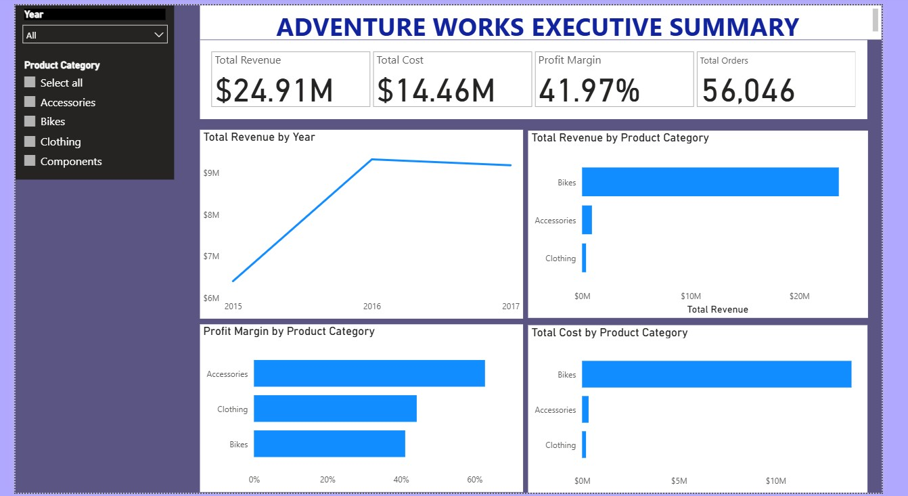
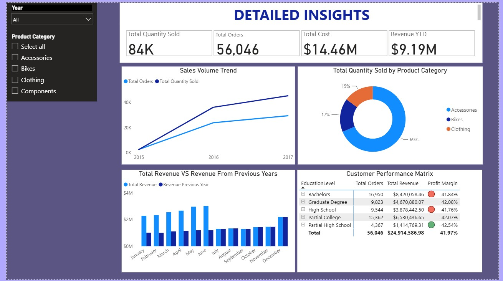

# Adventure Works Sales Analysis – Power BI Dashboard

Professional end-to-end Power BI project analyzing Adventure Works sales performance across 2015–2017.

---

## Project Overview

This project delivers a complete business intelligence solution for **Adventure Works**, covering sales performance, product analysis, customer insights, returns, and territorial performance.

The goal is to provide clear, actionable insights for sales, marketing, and operations stakeholders through interactive dashboards built with best-practice data modeling and DAX.

---

## Key Business Questions Answered

- What are the overall sales trends and year-over-year performance (2015–2017)?
- Which product categories and subcategories drive the most revenue and profit?
- How do different customer segments (by education level, etc.) perform?
- What is the relationship between sales volume and revenue by category?
- How does profit margin vary across product categories?

---

## Tech Stack

| Tool               | Purpose                            |
|--------------------|------------------------------------|
| Power BI Desktop   | Report development & data modeling |
| Power Query        | Data cleaning & transformation     |
| DAX                | Measures & business logic          |
| CSV (Excel origin) | Source data                        |

---

## Data Model

- **Star schema** design
- **Fact tables**: Sales, Returns
- **Dimension tables**: Calendar (Dim_Date), Products, Customers, Territories, Product Categories & Subcategories
- Proper relationships and cardinality
- Dedicated `_Measures` table for organization
- Optimized data types and clean naming conventions

---

## Key Features

- Interactive **Executive Summary** page with high-level KPIs
- **Detailed Insights** page with volume trends, category breakdown, YoY comparison, and customer performance matrix
- Dynamic filters (Year, Product Category)
- Conditional formatting on key metrics
- Clean visual hierarchy and consistent design

### Sample KPIs

- **Total Revenue**: $24.91M
- **Total Cost**: $14.46M
- **Profit Margin**: 41.97%
- **Total Orders**: 56,046

---

## Screenshots

### 1. Overview Page (Executive Summary)



### 2. Detailed Insights Page



---

## How to Use

1. Clone or download this repository
2. Open `Report/AdventureWorks_Sales_Analysis.pbix` in **Power BI Desktop**
3. The data sources point to the CSV files in the `/Data` folder  
   *(You may need to update the file path once via Transform data → Data source settings)*
4. Refresh the data if prompted

---

## Project Structure

```text
AdventureWorks-PowerBI/
├── Data/                          # Source CSV files
│   ├── AdventureWorks_Calendar.csv
│   ├── AdventureWorks_Customers.csv
│   ├── AdventureWorks_Products.csv
│   ├── AdventureWorks_Product_Categories.csv
│   ├── AdventureWorks_Product_Subcategories.csv
│   ├── AdventureWorks_Returns.csv
│   ├── AdventureWorks_Sales_2015.csv
│   ├── AdventureWorks_Sales_2016.csv
│   ├── AdventureWorks_Sales_2017.csv
│   └── AdventureWorks_Territories.csv
├── Images/                        # Dashboard screenshots
│   ├── 01-Overview-Page.jpg
│   └── 02-Detailed-Insights-Page.jpg
├── Report/
│   └── AdventureWorks_Sales_Analysis.pbix
├── .gitignore
└── README.md
